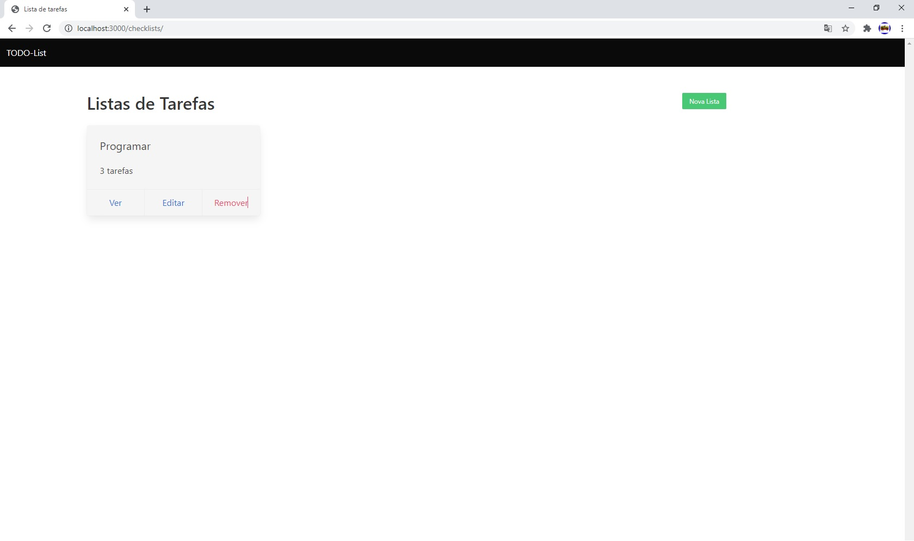

<h1 align="center">
  Todo-List
</h1>




## :page_facing_up: Descrição
Usando os conhecimentos do curso, criei esse todo-list, onde o usuário pode cadastrar um Checklist de tarefas, como por exemplo as tarefas para serem feitas na manha, e dentro desse Checklist, pode ser criada varias Tasks, as mesmas podem ser marcadas como concluidas, e desmarcadas, facilitando a identificação do usuário.

## 🛠 Tecnologias
Este projeto foi desenvolvido com as seguintes tecnologias

- [Node.js](https://nodejs.org/en/)
- [EJS](https://ejs.co/)
- [MongoDB](https://www.mongodb.com/)

## :clipboard: Funcionalidades
- [x] Criar e deletar checklists.
- [x] Criar e deletar tarefas dos checklists.
- [x] Marcar como concluida, e desmarcar.

## :closed_book: Instalação

### Pré-requisitos
Antes de começar, você vai precisar ter instalado em sua máquina as seguintes ferramentas:
[Git](https://git-scm.com) e [Node.js](https://nodejs.org/en/).
Além disto é bom ter um editor para trabalhar com o código como [VSCode](https://code.visualstudio.com/)

### 🎲 Rodando o projeto

```bash
# Clone este repositório
$ git clone git@github.com:FeSilva-dev/TodoList-EJS_and_MongoDB.git

# Vá para a pasta a raiz do projeto
$ cd TodoList-EJS_and_MongoDB

# Instale as dependências
$ npm install

# Inicie o servidor
$ npm run dev

# O servidor inciará na porta 3000 - url <http://localhost:3000>
```


## :man: Autor

<a href="https://github.com/FeSilva-dev">
 
 <br />
 <sub><b>Felipe Silva</b></sub>
</a>


Feito com carinho por Felipe Silva :wave::wave: Entre em contato!🚀
